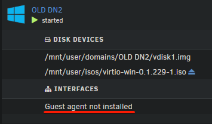

# Ansible Collection - strimblaster.unraid

This collection provides a dynamic inventory plugin for unraid vms.

Requires Ansible version >= 2.16

## Inventory Plugin - strimblaster.unraid.vm_inventory

This inventory plugin accesses unraid and retrieves all **running** vms according to a pattern.

### Installation
```
ansible-galaxy collection install strimblaster.unraid
```
### Inventory yml configuration example

Inventory filename: "unraid_vm_inventory.yml"
```
plugin: strimblaster.unraid.vm_inventory

unraid_host: "192.168.1.223"
unraid_user: "root"
unraid_password: !vault | ......
vm_name_pattern: "^\\[Ansible\\].+"
ansible_user: "ansible"
```

- **unraid_host** (required): IP address or Hostname of the Unraid machine
- **unraid_user**/**unraid_password** (required): SSH Credentials to access unraid
- **vm_name_pattern** (optional, default '.*'): Regex pattern to filter the vms retrieved by the plugin
- **ansible_user** (optional, default None): User to be used to connect to every VM

### Requirements

- Paramiko ``` pip install paramiko ```

### Warnings

- To be able to get the IP addresses in the VM, QEMU Agent must be installed in the VM



- When parsing VMs with multiple interfaces, the first ethernet interface with ipv4 will be chosen

### How it works
TODO


